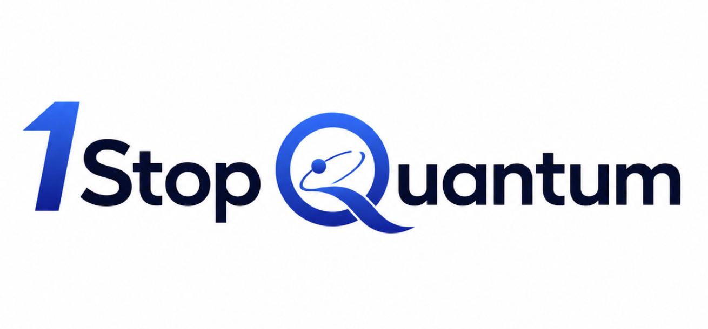
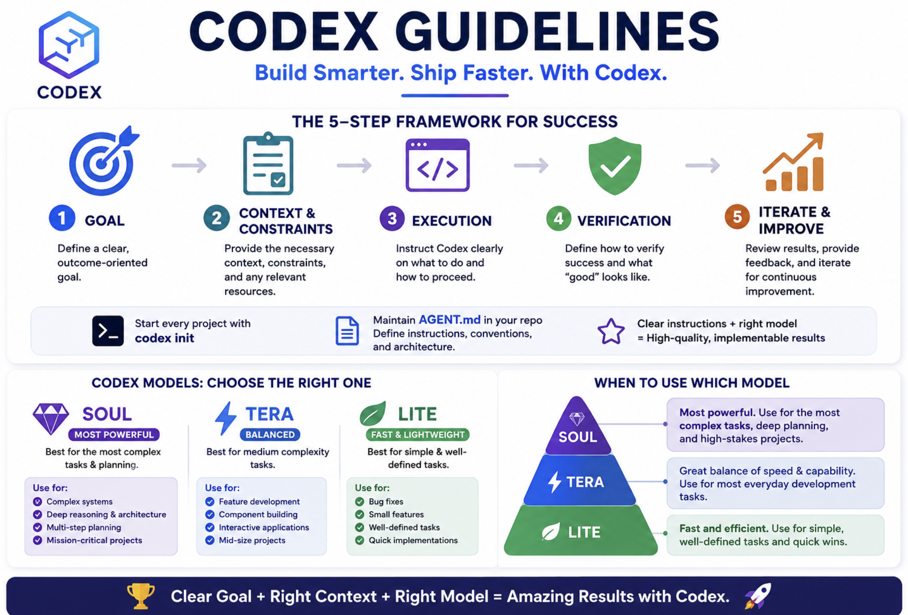

# 1StopQuantum — AI-Assisted Quantum Learning Platform

<p align="center"></p>

> Ask a quantum question in plain language, see the circuit and state evolve, and
> test your understanding in guided local simulations. **1StopQuantum** combines
> narrated courses, interactive labs, constrained AI circuit generation, and
> evidence literacy in one accessible learning platform. Compatibility identifiers
> such as `quantumyog.dev/v1`, `qyog`, and existing repository paths remain stable.
> Its core runtime is local:
> a Monaco-based IDE, Qiskit/Cirq simulation (no real QPU), PostgreSQL, and an
> administrator-selected OpenAI-compatible LLM that turns plain English into
> circuits and algorithms. An optional MCP endpoint adds ChatGPT rendering.

**Human creator:** Tarun Kumar Chawdhury
**Primary use case:** AI-assisted quantum education for high-school, university,
and professional learners, with reproducible tools for educators.
**Status:** Working local implementation for hackathon demonstration and continued
development.

## Key highlight

> **1StopQuantum is powered by Sumi**, an AI Learning Companion that turns a
> voice conversation into an AI-native learning experience that explains,
> demonstrates, acts, and verifies. This is the central product idea of the
> submission: learners learn quantum computing by doing, with Sumi grounded in
> the current screen and limited to safe, visible application actions.


## Author and acknowledgment

Tarun Chawdhury, author of this repository, completed a master's education in
artificial intelligence at Georgia Tech. He gratefully acknowledges the education
he received there as an important foundation for this work. 1StopQuantum and Sumi
are independent research created for the OpenAI Hackathon. References to Georgia
Tech, OpenAI, technology providers, companies, products, or other organizations
are for educational, attribution, and interoperability purposes only. Names and
trademarks remain the property of their owners; their use does not imply
sponsorship, endorsement, partnership, or association.

## How Codex helped build this submission



This project began as a top-level product idea developed with ChatGPT Voice and
became a working application through an iterative Codex workflow:

1. **Idea to design:** convert the idea into a design prompt, define agent roles,
   create a harness and repeatable build loop, then write the repository's
   constraints and conventions in [`AGENTS.md`](AGENTS.md).
2. **Implementation:** use Codex to organize the application, database, Sumi
   SDK/CLI, local Whisper and Kokoro APIs, setup scripts, documentation, and
   copied media assets.
3. **Feedback and iteration:** manually run the application, inspect screens and
   workflows, report issues, and iterate on the implementation and UX.
4. **Self-evaluation:** ask Codex to evaluate both API behavior and browser UI
   behavior, using pytest plus Playwright accessibility, interaction, and
   responsive-layout checks before shipping.

The Codex 5.6 model roles followed the same discipline shown above: **Soul** for
deep planning and architecture, **Tera** for balanced feature implementation and
integration, and **Lite** for fast, well-defined fixes, validation, and polish.
Human review remained responsible for product direction, feedback, acceptance,
and the final OpenAI Hackathon submission.

## Two products, one repository

This codebase ships two connected but independently useful products:

| Product | Purpose | Main paths |
| --- | --- | --- |
| **1StopQuantum** | Local quantum-computing courses, circuit labs, simulation, accounts, and evidence-based benchmark learning | `app/`, `public/`, `database/` |
| **Sumi Framework** | Provider-neutral AI learning companion that can be embedded in another learning platform | `public/sumi-*.js`, `scripts/sumi-framework-cli.js`, `docs/SUMI_FRAMEWORK.md` |

Compatibility names such as `quantumyog`, `qyog`, and `quantumyog.dev/v1` remain
in the code and data formats intentionally. Do not rename them without a migration.

## Repository layout

```text
app/                 FastAPI, simulation, persistence, MCP, and voice services
public/              Browser app, Sumi SDK, course media, and 3-minute pitch
database/            Idempotent PostgreSQL schema, seed data, and database guide
scripts/             Setup, local servers, asset authoring, and Sumi CLI
docs/                Architecture, setup, learning content, APIs, and SDK guides
examples/            Runnable JSON/YAML circuit manifests
tests/, evals/       Pytest and Playwright release suites
integrations/        ChatGPT/Custom GPT integration contracts
```

## Apple Silicon quick start

These instructions target a clean M-series MacBook. Docker is not required.

### 1. Clone and run the installer

Git is the only prerequisite needed to clone the project. The root installer
bootstraps Homebrew when needed, installs Python 3.12, Node 20, and PostgreSQL 16,
creates `.venv`, installs locked Node dependencies, builds browser assets,
provisions the database, and installs Playwright:

```bash
git clone <repository-url> sumi
cd sumi
./setup.sh
```

If the system packages already exist or the browser tests are not needed:

```bash
INSTALL_SYSTEM_DEPS=0 INSTALL_PLAYWRIGHT_BROWSERS=0 ./setup.sh
```

The installer creates ignored `.env` and `.env.setup` files. Never commit them.
It is safe to rerun. A reachable `DATABASE_URL` in `.env` is reused and migrated;
otherwise the installer reuses a healthy local PostgreSQL service or installs and
starts PostgreSQL 16 before creating the application database.

### 2. Choose the AI mode

For a fully local model, install and start an OpenAI-compatible server such as
Ollama, then edit `LLM_BASE_URL` and `LLM_MODEL` in `.env`:

```bash
brew install ollama
brew services start ollama
ollama pull qwen2.5-coder:14b
```

Use `http://127.0.0.1:11434/v1` as the Ollama base URL. If no model is available,
the platform can still run its deterministic lessons, templates, and simulators.

### 3. Start and verify the application

```bash
# Normal mode: requires the configured LLM to respond
./manage.sh start

# Or local classroom/judge mode without an LLM
ALLOW_LLM_UNAVAILABLE=1 ./manage.sh start

./manage.sh status
curl -fsS http://localhost:8000/health
open http://localhost:8080
```

The app runs at <http://localhost:8080>, the API at port `8000`, MCP at `8001`,
and the optional local voice service at `5152`. Use `./manage.sh log --follow`
for diagnostics and `./manage.sh stop` for a clean shutdown.

Live Whisper/Kokoro voice is optional because narration audio is already bundled.
On Apple silicon, install it with `./scripts/setup-local-voice.sh`; otherwise set
`VOICE_AUTOSTART=0` in `.env`. See
[`docs/LOCAL_AI_SETUP.md`](docs/LOCAL_AI_SETUP.md) for the exact MLX Whisper,
Kokoro, Ollama, MLX-LM, llama.cpp, remote-LLM, endpoint, and health-check setup.

## Database setup

PostgreSQL stores learners, roles, educational plan entitlements, scheduled
improvement jobs, feedback, analytics, moderation records, and encrypted LLM
settings. It stores no payment-card data.

The normal installer performs every database step. To provision or repair it
separately:

```bash
brew install postgresql@16
brew services start postgresql@16
export PATH="$(brew --prefix postgresql@16)/bin:$PATH"
./scripts/setup-postgres.sh
```

That idempotent script creates the local `quantumyog` role and database, applies
`database/schema.sql`, loads `database/seed.sql`, creates local admin/demo users,
and writes `DATABASE_URL` to the ignored `.env`. Verify the result with:

```bash
set -a; source .env; set +a
pg_isready -h 127.0.0.1 -p 5432
psql "$DATABASE_URL" -c '\dt'
```

To apply the schema manually to an existing database, set `DATABASE_URL`, then run:

```bash
psql "$DATABASE_URL" -v ON_ERROR_STOP=1 -f database/schema.sql
psql "$DATABASE_URL" -v ON_ERROR_STOP=1 -f database/seed.sql
```

Both SQL files are safe to rerun. Managed PostgreSQL users should set
`POSTGRES_ADMIN_URL`, `QUANTUMYOG_DB_NAME`, `QUANTUMYOG_DB_USER`, and
`QUANTUMYOG_DB_PASSWORD` before running `scripts/setup-postgres.sh`. See
[`database/README.md`](database/README.md) for schema contents, demo credentials,
security behavior, and backup guidance.

## Integrating Sumi into another learning platform

Sumi is not tied to quantum computing. It connects three server-owned provider
adapters—speech-to-text, LLM, and text-to-speech—to an application-owned registry
of allowed UI actions. The browser executes only registered actions and returns
verified results; model output never becomes arbitrary JavaScript or selectors.

```bash
npm run sumi-framework -- init \
  --screen lesson-lab --title "Lesson Lab" --out ./public/sumi
npm run sumi-framework -- validate ./public/sumi/lesson-lab.registry.json
```

Open [`docs/SumiFramework.html`](docs/SumiFramework.html) for the standalone HTML
SDK + CLI guide. The detailed contracts are in
[`docs/SUMI_FRAMEWORK.md`](docs/SUMI_FRAMEWORK.md) and
[`docs/SUMI_VOICE_SDK.md`](docs/SUMI_VOICE_SDK.md).

## Learner value

- **Ask:** Translate plain-language intent into a constrained, reviewable circuit.
- **See:** Inspect each gate's effect on amplitudes, phase, Bloch vectors, and
  entanglement instead of seeing only final counts.
- **Practice:** Predict, simulate, explain, and complete formative checkpoints.
- **Listen:** Continue narrated courses and podcast episodes on a phone.
- **Evaluate:** Compare quantum proposals with classical baselines and evidence.

## Current platform

- Public access begins in **Learn**. Circuit Studio, Use Cases, Drug Discovery,
  Providers, Benchmark, Improve, Podcast, and Community require a local account;
  a protected destination reopens after sign-in. Help, About, policies, FAQ, and
  credits remain public information surfaces.
- Beginner and executive introductions connect classical CPUs/GPUs to the
  quantum-coprocessor model, post-quantum readiness, realistic optimization,
  supply chains, chemistry, simulation, and evidence-based investment decisions.
- The **Use Case Center** covers chemistry, materials, logistics, cybersecurity,
  finance, energy, climate, and public-sector assessment. Every case includes a
  classical baseline, quantum candidate, resource assumptions, current hardware
  limits, primary sources, provider fit, claim strength, and a suitability check.
- The **1StopQuantum Podcast** bundles four long Kokoro episodes with Play All,
  sequential playback, chapters, transcripts, downloads, saved position/speed,
  lock-screen metadata, offline PWA caching, a versioned API, and an RSS feed.
- Community research, contributor, and reviewer requests collect only first-contact
  name/email/type/consent, expire after 24 months, and enter an audited moderation
  queue. Public APIs strip contact details and private review data.
- Every primary workspace has a replayable product tour with real control
  highlighting, a practical action, keyboard navigation, and reduced-motion support.
- An interactive **Quantum computing 101** workspace for high school,
  undergraduate, and Master's learners. A versioned 16-lesson tree organizes four
  short courses: Quantum foundations, Quantum effects, Algorithms through
  experiments, and Hardware & evidence. Every lesson includes saved Kokoro audio,
  a distinct reviewed visual, animated explanation, objectives, a classical
  comparison, prediction, simulator practical, and checkpoint. The established
  Three.js/WebGL Bloch sphere, D3 comparisons, and seven hands-on labs remain the
  experimental core. A persistent audio guide also summarizes how to use every
  primary workspace.
- Controlled local media authoring: `scripts/generate_course_audio.py` reads the
  curriculum tree and idempotently regenerates WAV narration through Kokoro;
  `scripts/generate_course_images.py` creates lesson visuals through ComfyUI.
  These are maintainer tools, not learner features. The browser receives only
  versioned static media and provenance metadata, so classroom runtime is
  independent of either authoring service.
- Sumi's reusable browser voice SDK is documented in
  [`docs/SUMI_VOICE_SDK.md`](docs/SUMI_VOICE_SDK.md), including opt-in persistent
  listening, barge-in, cleanup, and the adapter boundary for additional screens.
- Normal page loads begin in Learn. After sign-in, the shared gate palette opens
  Circuit Studio and inserts the selected gate. Use
  `http://localhost:8080/?view=circuits` for a direct Circuit Studio link.
- An installable Progressive Web App with local icons and an offline app shell.
  Each `manage.sh start` or `restart` rotates the browser build token; critical
  bootstrap assets use `no-store`, and the service worker removes prior caches.
- Natural-language circuit generation through the configured LLM, with
  strict IR validation, deterministic peephole simplification, a semantic-fidelity
  retry, a deterministic degree-to-radian compiler for the built-in rotation lesson,
  and a visible warning when requested and generated qubit counts still differ.
- Qiskit and Cirq local simulation, generated Python source, operation-by-operation
  statevector stepping, phase-aware amplitudes, Bloch spheres, entanglement lessons,
  measurement histograms, and an explicit bit-order convention.
- Deterministic one-click GHZ, Grover `|11>`, Deutsch-Jozsa, and QRNG templates,
  including the selected template parameters in the workspace.
- Local source and circuit exports (`.py`, SVG, and PNG) plus browser-local session
  restoration for the latest prompt, circuit, and backend.
- Educational drug-discovery scoring with RDKit descriptors, per-rule Lipinski
  results, optional side-by-side SMILES comparison, and simulated VQE indicators.
- A provider lab with editable QUBO JSON, local simulated annealing, an energy
  histogram, and an intent-routing lesson that distinguishes gate-model circuits
  from annealing optimization requests.
- An evidence-backed **Benchmark** workspace built from a bundled, attributable
  Metriq snapshot. It includes an animated hardware landscape, QPU matching with
  separate suitability and evidence scores, uncertainty-aware trend projections,
  a source-linked update digest, public-sector use-case gates, and a QBI-inspired
  provider-claim review. It is an independent educational screen, not a DARPA
  determination or live hardware procurement system.
- A versioned `quantumyog.dev/v1` declarative language in JSON or YAML. The local
  LLM can generate a manifest, the browser can edit and visualize it, and the
  Terraform-style `qyog` CLI can format, validate, plan, compile, run, and open it.
- An in-app academic tutorial plus an instructor/student guide that introduces
  state, amplitude, probability, phase, gates, measurement, interference, and
  entanglement before advancing to manifests, providers, and applied modules.
- A searchable in-app documentation center opened from the persistent top-right
  Help control, with end-user tutorials, API guidance, provider concepts, CLI
  examples, and ChatGPT integration instructions. A neighboring About control
  reports the app version, current build, purpose, simulation boundary, and data
  attribution without taking space from the primary workspaces.
- A public Credits page acknowledges human/AI co-development, Metriq sources,
  quantum frameworks, scientific libraries, application infrastructure, testing,
  and maintainer-only media tools with direct upstream links.
- An MCP App endpoint that returns validated circuit data and an embedded
  visualization resource for ChatGPT, plus a separate OpenAPI schema for Custom
  GPT Actions.
- PostgreSQL-backed local accounts, educational subscription entitlements, and
  scheduled circuit-improvement jobs. Returning learners can sign in, sign out,
  and reset a forgotten password by answering their saved recovery challenge.
  Passwords and normalized recovery answers use PBKDF2 hashes. No card or payment
  data is collected. Account actions remain in the persistent top utility bar so
  the learning palette contains quantum concepts only.
- A beginner gate bridge compares classical AND, OR, NOT, and XOR with reversible
  Toffoli, Pauli X, and CNOT constructions, including the role of measurement.
- Anonymous or signed-in learners can mark a lesson helpful or report an
  inaccuracy. A deterministic FAQ assistant, compact legal footer, AI-use notice,
  and per-image provenance explain the app without calling a runtime chatbot.
- An internal-only admin dashboard reports daily visitors, popular pages, and
  feedback; moderates community requests; changes the database-authoritative
  password; and switches between a local OpenAI-compatible endpoint and OpenAI.
  Provider keys are encrypted in PostgreSQL and never returned to the browser.
- A bounded plan/propose/review optimizer that accepts a rewrite only when it
  lowers circuit cost and preserves the statevector up to global phase, then saves
  a standalone HTML audit report.

## Declarative quick start

```bash
./qyog validate examples/bell.qyog.yaml
./qyog plan examples/bell.qyog.yaml
./qyog compile examples/bell.qyog.yaml --target qiskit --output bell.py
./qyog run examples/bell.qyog.yaml
./qyog visualize examples/bell.qyog.yaml
```

Generate the same portable artifact from natural language through the configured
LLM:

```bash
./qyog generate "Build a 3-qubit GHZ state" \
  --name ghz-lesson \
  --output ghz-lesson.qyog.yaml
```

See [`docs/QUANTUM_101_CURRICULUM.md`](docs/QUANTUM_101_CURRICULUM.md) for the
level-aware course design, [`docs/ACADEMIC_GUIDE.md`](docs/ACADEMIC_GUIDE.md) for
the learning sequence, and [`docs/MANIFEST_LANGUAGE.md`](docs/MANIFEST_LANGUAGE.md)
for the language and CLI reference. Benchmark methodology and limitations are in
[`docs/BENCHMARK_INTELLIGENCE.md`](docs/BENCHMARK_INTELLIGENCE.md), with source
credit and transformation details in
[`docs/METRIQ_ATTRIBUTION.md`](docs/METRIQ_ATTRIBUTION.md).
Media regeneration and environment settings are documented in
[`docs/MEDIA_AUTHORING.md`](docs/MEDIA_AUTHORING.md). Podcast and community APIs
are in [`docs/PODCAST_API.md`](docs/PODCAST_API.md) and
[`docs/COMMUNITY_API.md`](docs/COMMUNITY_API.md).

## Development and verification

Setup creates a private administrator and encryption key in `.env`. Open
<http://localhost:8080/?admin=1> and use those credentials to configure a local
OpenAI-compatible service or OpenAI. Public pages never expose provider settings.
Provisioning also creates this local-only Scholar account:

```text
Email: learner@1stopquantum.local
Password: LearnQuantum2026!
Recovery answer: superposition
```

The sign-in dialog can fill these credentials with **Use demo account**. They are
for the local demo only and must not be reused for a public deployment.

Common development and verification commands are:

```bash
npm run build         # syntax-check and bundle browser JavaScript
make evals-cli        # backend and CLI pytest suites
make evals-ui         # Playwright browser suite
make evals            # complete gate: CLI followed by UI
make demo             # foreground API, MCP, frontend, and optional voice
```

Kokoro and ComfyUI are optional authoring dependencies. The generated media is
already committed; maintainers can regenerate it with `make course-audio` and
`make course-images`. For normal background operation, prefer the manager:

```bash
./manage.sh start
./manage.sh status
./manage.sh log             # latest 100 lines
./manage.sh log --follow    # follow the consolidated log
./manage.sh restart
./manage.sh stop
```

PID and log files live under ignored `.run/`. `make demo` remains useful for
foreground development. `start` and `restart` generate a new `.run/build-id`, so
reloading the page activates the matching service worker and removes the previous
app-shell cache. No hard refresh or manual browser-cache deletion is required.

---

## Why this exists

Quantum frameworks today (Qiskit from IBM, Cirq from Google) are powerful but live
in the terminal or in Jupyter notebooks. That's a wall for beginners and a bigger
wall for domain experts (e.g. clinicians and biologists) who understand the
*science* but not the code.

1StopQuantum lowers that wall three ways:

1. **Visual first.** Learners manipulate a WebGL Bloch sphere, compare classical
   and quantum probabilities in accessible D3 charts, and connect those views to
   the circuit diagram, amplitudes, and measurement counts.
2. **Natural language → circuit or algorithm.** A user types *"entangle two
   qubits and measure them"* or *"Grover search for |11⟩"* and the
   **administrator-selected LLM**
   turns it into a validated Circuit IR (single gates or algorithm templates),
   which is executed on a local simulator and visualized.
3. **Browser-served, locally hosted.** Monaco, simulation, media, and the teaching
   workspace are served from `localhost`. Circuit prompts stay local by default;
   selecting OpenAI in the internal admin screen sends those prompts to OpenAI.

The application embeds Monaco directly so it stays small and portable across
macOS and Rocky Linux.

An optional **drug-discovery teaching module** illustrates a deterministic,
non-clinical workflow with molecular descriptors and simulated VQE convergence.
It does not design molecules, predict efficacy, or perform biological research.

---

## Scope guardrails (read before building)

- **Local-first.** Simulation, LLM, frontend, scheduler, and database run on the
  host. The optional ChatGPT integration deliberately exposes only the MCP
  endpoint through HTTPS; using it sends the selected prompt/result through
  ChatGPT. The standalone app needs no cloud AI API.
- **Simulation only.** We simulate what a QPU *would* do on classical hardware.
  No real quantum-hardware access is assumed or required. Small circuits
  (≤ ~20 qubits) run comfortably on a laptop. Real-QPU providers (IonQ, D-Wave)
  are documented as a *future* abstraction in `docs/PROVIDERS.md`, not built now.
- **Benchmark intelligence is screening, not certification.** Historical public
  results can expose trends and evidence gaps, but they do not establish live
  availability, price, queue time, fault tolerance, utility, or vendor claims.
  Different benchmark families remain separate and every decision starts with a
  named classical baseline.
- **Educational accuracy > performance.** We are teaching concepts. Do not claim
  quantum speedup is actually happening locally — the UI is explicit that
  this is a *simulator*.
- **Drug-discovery module is illustrative.** Binding-affinity results are for
  teaching the *pipeline and physics intuition*, not for clinical or research use.
  Every drug-discovery output carries a visible "educational / not for clinical
  use" banner.
